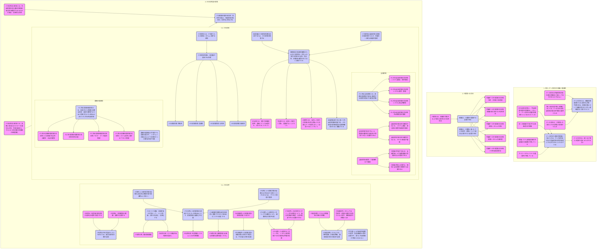

```mermaid
graph TD
    subgraph "1. 導入: ITへの対応の定義と重要性"
        A("ITへの対応とは、組織目標達成のために適切な方針・手続を定め、業務実施において組織内外のITに対し適時適切に対応すること")
        B("ITへの対応は内部統制の他の基本的要素と独立して存在するものではない")
        C("特にIT依存度が高い組織においては、ITへの対応は内部統制の有効性判断の基準となる")
        D("ITへの対応は、IT環境への対応とITの利用及び統制からなる")
        E("ITの浸透を背景に、「内部統制の基本的枠組み」において、ITへの対応は基本的要素の1つに加えられている")
        F("多くの組織がIT抜きでは業務遂行が困難")
        G("情報システム関連業務の外部委託の重要性が増している")
        H("サイバーセキュリティの重要性が増している")
        I("ITへの対応を基本的要素に加えたのは、ITへの適切な対応が内部統制の目的達成に不可欠であることを示すため")
        J("ITへの対応は、新たなIT導入や更新を強いるものではない")
        
        B & C --> A
        D --> A
        E --> I
        F & G & H --> I
        I --> J
    end

    subgraph "2. IT環境への対応"
        K("IT環境とは、組織が活動する上で関わる内外のIT利用状況")
        L("組織は、IT環境を理解する必要がある")
        M("組織は、IT環境に基づいてITの利用・統制について適切な対応を行う必要がある")
        N("考慮すべきIT環境の具体例: 社会・市場のIT浸透度")
        O("考慮すべきIT環境の具体例: 組織の取引等でのIT利用状況")
        P("考慮すべきIT環境の具体例: 情報システムの状況")
        Q("考慮すべきIT環境の具体例: 情報システムの安定度")
        R("考慮すべきIT環境の具体例: ITの外部委託状況")

        K --> L
        L & M --> N & O & P & Q & R
    end

    subgraph "3. ITの利用及び統制"
        S("ITの利用及び統制とは、内部統制の他の基本的要素の有効性を確保するためのITの有効・効率的な利用")
        T("ITの利用及び統制とは、業務に組み込まれたITへの適切な方針・手続の設定と、それによる他の基本的要素の機能強化")
        S & T --> U("ITは情報処理の有効性・効率性を高め、内部統制の有効化・効率化に寄与する")
        
        subgraph "3.1. ITの利用"
            V("IT利用は、経営者の意向等の迅速な伝達を可能にする")
            W("IT利用は、統制環境の整備・運用を支援する")
            X("IT利用は不正共謀のリスクもあるため、適切な統制活動が必要")
            Y("ITはリスク認識・情報共有の手段として、リスク評価・対応を有効化・効率化する")
            Z("IT利用の例: 売掛債権管理")
            AA("IT利用の例: リスク情報共有範囲の見直し")
            AB("ITを利用した統制活動の業務プロセスへの組込みにより、統制活動の自動化が可能")
            AC("IT利用の例: 生産管理システムによる在庫管理")
            AD("IT利用による統制活動の自動化は迅速な情報処理や誤謬防止に役立つ")
            AE("IT利用による統制活動の自動化は不正改ざん等のリスクもあるため、アクセス管理が重要")
            AF("ITは組織内情報伝達を効果的に業務プロセスに組み込むことを可能にする")
            AG("IT利用の例: 業務管理に必要な情報の自動伝達システム")
            AH("ITは組織外への情報公開や情報収集にも役立つ")
            AI("ITを組織外への情報公開や情報収集に利用する場合は、不正侵入対策が必要")
            AJ("ITを利用した日常的モニタリングの自動化により、網羅的な実施が可能")
            AK("ITを利用した日常的モニタリングの自動化により、独立的評価の頻度・人員を削減できる可能性がある")
            AL("ITを利用した日常的モニタリングは、システム設計段階からの計画的な準備が必要")
            AM("IT高度利用システムは稼働後の修正が困難")
            AN("IT高度利用システムでは、手続き・情報の変更が記録されない場合、事後検証が困難となる")
            AO("IT高度利用システムでは、特性理解、計画的準備、事後検証方法の検討が必要")
            AP("手作業による内部統制運用の場合、別途誤謬防止策が必要だが、直ちに内部統制の不備とはならない")

            V & W --> X
            Y --> Z & AA
            AB --> AC
            AD & AE --> AB
            AF --> AG
            AH --> AI
            AJ & AK --> AL
            AM & AN --> AO
        end

        subgraph "3.2. ITの統制"
            AQ("ITの統制とは、ITを取り入れた情報システムに関する統制")
            AR("ITの統制目標は、経営者が設定する目標")
            AS("ITの統制目標: 準拠性")
            AT("ITの統制目標: 信頼性")
            AU("ITの統制目標: 可用性")
            AV("ITの統制目標: 機密性")
            AW("財務報告の信頼性確保のためのITの統制は、会計上の取引記録の正当性、完全性、正確性を確保するために実施される")
            AX("正当性とは、取引が組織の意思・意図にそって承認され、行われることをいう")
            AY("完全性とは、記録した取引に漏れ、重複がないことをいう")
            AZ("正確性とは、発生した取引が財務や科目分類などの主要なデータ項目に正しく記録されることをいう")
            BA("金融商品取引法に基づく内部統制報告制度では、ITの統制も財務報告の信頼性確保のために整備される")
            BB("経営者はITの統制目標を達成するため、ITの統制を構築する")
            BC("ITの統制は全般統制と業務処理統制からなり、両者の一体的な機能が重要")

            AQ --> AR
            AR --> AS & AT & AU & AV
            AW --> AX & AY & AZ
            AW --> BA
            BB & BC --> AW

            subgraph "全般統制"
                BD("ITに係る全般統制とは、業務処理統制が有効に機能する環境を保証する統制活動")
                BE("ITに係る全般統制の具体例: システム開発・保守管理")
                BF("ITに係る全般統制の具体例: システム運用・管理")
                BG("ITに係る全般統制の具体例: システム安全性確保")
                BH("ITに係る全般統制の具体例: 外部委託契約管理")
                BI("全般統制が有効でないと、業務処理統制の有効性が保証されない可能性がある")
                BJ("全般統制の有効性を確保するには、システム開発・変更時の整合性確認が重要")
                BK("全般統制の有効性を確保するには、アクセス管理が重要")
                BL("全般統制は通常、IT基盤単位で構築")
                BM("IT基盤が共通であれば、全般統制により複数業務の信頼性向上が期待できる")
                BN("IT基盤が異なる場合は、個別に全般統制を構築する必要がある")

                BD --> BE & BF & BG & BH
                BI --> BJ & BK
                BL --> BM
                BL --> BN
            end

            subgraph "業務処理統制"
                BO("ITに係る業務処理統制とは、承認された業務の正確な処理・記録を確保するために業務プロセスに組み込まれたITに係る内部統制")
                BP("ITに係る業務処理統制の具体例: 入力情報の完全性・正確性・正当性確保")
                BQ("ITに係る業務処理統制の具体例: 例外処理")
                BR("ITに係る業務処理統制の具体例: マスタ・データ維持管理")
                BS("ITに係る業務処理統制の具体例: システム利用に関するアクセス管理")
                BT("業務処理統制は手作業でも実施可能だが、システムへの組込みにより効率的かつ正確な処理が可能")

                BO --> BP & BQ & BR & BS
            end
        end
    end

    classDef premise fill:#f9f,stroke:#333,stroke-width:2px
    classDef conclusion fill:#ccf,stroke:#333,stroke-width:2px
    classDef logical_formula fill:#ccf,stroke:#333,stroke-width:2px
    classDef hidden_premise fill:#f9f,stroke:#333,stroke-width:2px
    classDef intermediate_conclusion fill:#f9f,stroke:#333,stroke-width:2px

    class A,B,C,D,E,F,G,H,I,J,K,L,M,N,O,P,Q,R,S,T,U,V,W,X,Y,Z,AA,AB,AC,AD,AE,AF,AG,AH,AI,AJ,AK,AL,AM,AN,AO,AP,AQ,AR,AS,AT,AU,AV,AW,AX,AY,AZ,BA,BB,BC,BD,BE,BF,BG,BH,BI,BJ,BK,BL,BM,BN,BO,BP,BQ,BR,BS,BT premise
    class A,I,L,M,U,X,Y,AB,AD,AE,AF,AI,AJ,AO,AP,AQ,AR,AW,BA,BB,BC,BD,BO,BT conclusion
    class AS,AT,AU,AV logical_formula
```
